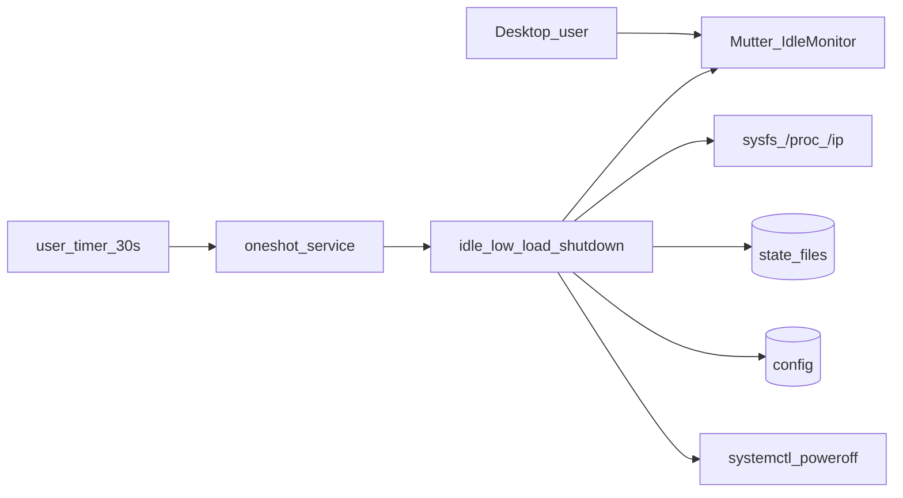
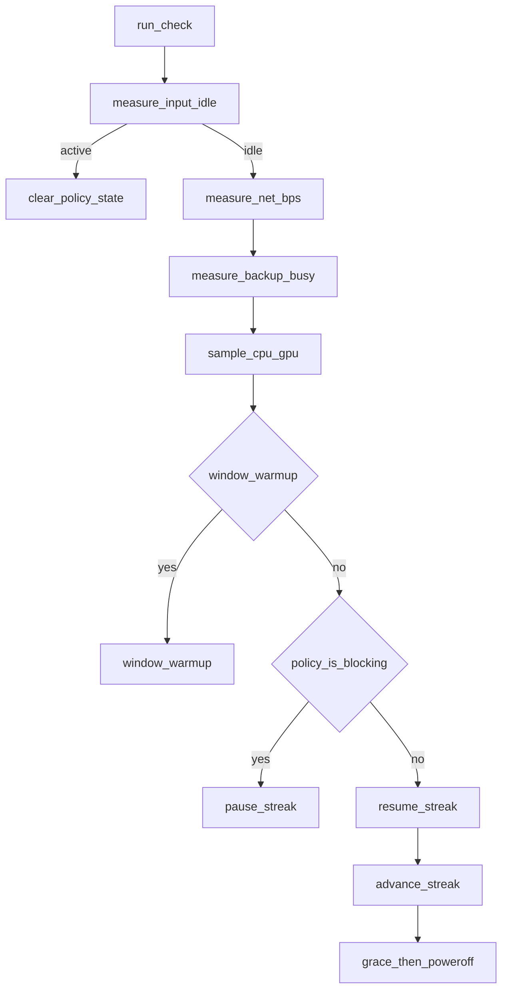

# Graceful shutdown — implementation

## Architecture (C4-ish)

### Container



### Component (checker)



**ADR:** [ADR-001](architecture/ADR-001-graceful-shutdown-policy.md)

## Components

| Layer | Path | Role |
|-------|------|------|
| Timer | `idle-low-load-shutdown.timer` | `OnUnitActiveSec=30` → oneshot service |
| Service | `idle-low-load-shutdown.service` | `DBUS_SESSION_BUS_ADDRESS`, `Conflicts=` self |
| Checker | `~/.local/bin/idle-low-load-shutdown` | Policy orchestration (`CHECKER_VERSION=gs-lib-1`) |
| Libs | `~/.local/bin/graceful-shutdown-lib/{idle,load,net,backup}.sh` | Metrics helpers (functions only) |
| Config | `~/.config/graceful-shutdown/config` | Thresholds, safety flags |
| State | `~/.local/state/graceful-shutdown/` | Streak, pause, hysteresis, net, log |

Structure-only lib peel (no new ADR). Source order after config: `idle.sh` → `load.sh` → `net.sh` → `backup.sh`.

## Supported config keys

| Key | Default | Role |
|-----|---------|------|
| `POWEROFF_ENABLED` | `0` | Real poweroff gate |
| `DRY_RUN` | `0` | Log-only action path |
| `INPUT_IDLE_SEC` | `60` | Mutter idle before streak |
| `LOW_LOAD_STREAK_SEC` | `840` | Effective quiet streak |
| `CPU_MAX_PCT` / `GPU_MAX_PCT` | `10` / `15` | Enter busy |
| `CPU_IDLE_PCT` / `GPU_IDLE_PCT` | `7` / `10` | Leave busy (hysteresis) |
| `HYSTERESIS_OK_POLLS` | `2` | Consecutive floor-OK to leave busy |
| `GPU_DRM_CARD` | empty | Pin DRM card |
| `GPU_CHECK_VRAM` | `0` | Optional VRAM via rocm-smi |
| `LOAD_WINDOW_*` | enabled `0` | Opt-in soft sample window |
| `NET_CHECK_ENABLED` | `1` | Bulk stay-awake |
| `NET_RX/TX_MIN_BPS` | `204800` | ~200 KiB/s floors |
| `NET_BUSY_POLLS` | `2` | Sustained bulk debounce |
| `NET_IFACE` | empty | Pin iface; empty = default-route |
| `BACKUP_CHECK_ENABLED` | `1` | Pause while Déjà Dup **work** (unit / duplicity) |
| `BACKUP_TREAT_UI_PROCESS` | `0` | Legacy: also pause for lone `--backup` UI process |
| `GRACE_SEC` | `120` | Notify before poweroff |
| `EXT_CMD_TIMEOUT_SEC` | `5` | gdbus / rocm-smi timeout |
| `HIGH_LOAD_POLLS_TO_RESET` | `2` | Legacy; busy path uses **pause**, not wipe |
| `LOG_*` | see example | Heartbeat / journal / rotate |

## State files

| File | Set when | Cleared when |
|------|----------|--------------|
| `low-load-streak.epoch` | First quiet poll after input idle | User input, inhibit, grace cancel |
| `streak-pause-start.epoch` | Enter busy while streak exists | Resume (origin shifted) or policy clear |
| `load-hysteresis.state` | `idle` / `busy` | Policy clear |
| `hysteresis-ok.count` | Consecutive floor-OK polls while busy | Leave busy / clear |
| `net-prev.tsv` | Each net sample (`epoch`, `iface`, `rx`, `tx`) | Resync on gap / iface change |
| `net-busy-strikes.count` | Consecutive bulk-rate polls | Below floor / clear |
| `net-was-busy.flag` | After `event: net_busy` until clear | `net_clear` / policy clear |
| `backup-was-busy.flag` | After `event: backup_busy` until clear | `backup_clear` / policy clear |
| `backup-ui-pending.flag` | After `event: backup_ui_pending` until UI gone | `backup_ui_clear` / policy clear |
| `grace-start.epoch` | First `eligible` | Busy, user input, before streak complete |
| `last-poll.epoch` | Completed check | — |
| `load-window.tsv` | Streak-eligible samples (window on) | Policy clear |
| `check.lock` | `flock` | Process exit |

## Policy summary

```
blocking = hysteretic_load_busy OR sustained_net_bulk OR backup_active
if blocking: pause streak (freeze clock), clear grace
else: resume streak if paused, advance toward eligible → grace → poweroff
```

Grace cancel uses **instantaneous** hard load, one bulk net sample, or backup active (strict).

## Logging

- **`poll:`** — idle, cpu/gpu/vram, load, streak, `hyst=`, optional `win=`, `net_rx=` / `net_tx=` / `net_rx_min=` / `net_tx_min=` / `net_dir=` / `net_strikes=` / `net_if=` / `net=`, `backup=`
- **`decision=streak_paused reason=`** — `load` \| `net` \| `backup` composed with `+` (e.g. `load+net`, `load+backup`)
- **`event: streak resumed`** / `net_busy` / `net_clear` / `net_iface_changed` / `backup_busy` / `backup_clear` / `backup_ui_pending` / `backup_ui_clear`
- Timeouts on `gdbus` / `rocm-smi`; sysfs GPU preferred; early `mark_poll_now`

## Metrics

### Input idle

- **Unlocked:** Mutter `GetIdletime` first, then `loginctl` IdleSinceHint
- **Locked (`LockedHint=yes`):** prefer `loginctl` first (Mutter can be flaky on the lock screen), then Mutter
- External cmds via `timeout -k` (`EXT_CMD_TIMEOUT_SEC`)

### CPU / GPU

- CPU: `/proc/stat` over `CPU_SAMPLE_SEC`
- GPU: sysfs `gpu_busy_percent` (optional `GPU_DRM_CARD`); `rocm-smi` fallback
- **Enter busy:** sample (or soft window) above `CPU_MAX_PCT` / `GPU_MAX_PCT`
- **Leave busy:** `HYSTERESIS_OK_POLLS` consecutive polls at/below `CPU_IDLE_PCT` / `GPU_IDLE_PCT`

### Soft load window (`LOAD_WINDOW_ENABLED=1`)

Ring of `LOAD_WINDOW_POLLS` samples. Prefer `LOAD_WINDOW_MAX_HIGH` over derived frac from `MIN_OK_FRAC`. Default metric **`avg`**.

### Network bulk (`NET_CHECK_ENABLED=1`)

- **Iface (P0 / VPN-safe):** default IPv4 route device from `ip -4 route get 1.1.1.1` (VPN → tunnel; no VPN → wifi/eth). Optional `NET_IFACE=` pin. **Never sum** multiple ifaces. Fallback: single busiest non-`lo` by absolute counters. Iface change → resync + `event: net_iface_changed`.
- Counters: `/proc/net/dev` for that iface only; state `net-prev.tsv` = `epoch`, `iface`, `rx`, `tx`
- Busy when RX or TX ≥ min B/s for `NET_BUSY_POLLS` consecutive polls
- Defaults: 204800 B/s (~200 KiB/s), 2 polls

### Backup (`BACKUP_CHECK_ENABLED=1`)

Active (busy) when **any** of:

- `systemctl --user is-active deja-dup.service` → `active`
- `pgrep -x duplicity`

Not busy by default:

- Lone `deja-dup` whose cmdline is **not** `--gapplication-service` (often `--backup --auto` waiting on “Backup Finished”) — logged as `backup=ok/ui_pending`
- `deja-dup --gapplication-service` (always ignored)

Legacy: set `BACKUP_TREAT_UI_PROCESS=1` to also treat the UI/job process as busy.

Edge events: `backup_busy` / `backup_clear` / `backup_ui_pending` / `backup_ui_clear`. Quiet phases of incremental backup still pause the streak (as long as `duplicity` is alive).

### Streak pause

On busy: write `streak-pause-start.epoch`. Effective elapsed = `pause_start - streak_start` while paused. On resume: `streak_start += (now - pause_start)`.

### Poweroff

- `systemctl poweroff` after grace; respects `systemd-inhibit` shutdown blockers

## Concurrency

`flock -n` on `check.lock`; service `TimeoutStartSec=60`; timer `AccuracySec=1s`.

## set -e pitfalls (lesson 2026-07-14)

Under `set -e`, **command substitutions** abort the script when the substituted command returns non-zero:

```bash
# BAD — missing streak file → function status 1 → whole check exits 1
streak_start_epoch() { [[ -f "${STREAK_FILE}" ]] && cat "${STREAK_FILE}"; }
streak_start="$(streak_start_epoch)"

# OK — if/fi yields status 0 when the file is absent
streak_start_epoch() { if [[ -f "${STREAK_FILE}" ]]; then cat "${STREAK_FILE}"; fi; }
```

Symptom: `event: input_idle_ok` then silence in `check.log`, while `journalctl --user -u idle-low-load-shutdown.service` shows hundreds of `status=1/FAILURE` (~3s runtime = CPU sample). Not Suspend. ERR trap logs `event: unexpected_exit`.

Boolean helpers that end with bare `(( var == 1 ))` should prefer `[[ "${var}" == "1" ]]` or explicit `return 0/1` if ever called outside `if` / `||` / `&&`.

## Verification

```bash
./scripts/test/test-policy-math.sh   # offline policy math (duplicated smoke; does not source libs)
GS_TOPIC_ROOT="$PWD" ./scripts/verify-graceful-shutdown.sh
DRY_RUN=1 ~/.local/bin/idle-low-load-shutdown
```

## Legacy mistake (2026-07-08)

`graceful-shutdown.timer` with fixed 15‑min poweroff — removed by install.

## Related

- [README.md](../README.md)
- [ADR-001](architecture/ADR-001-graceful-shutdown-policy.md)
- [lessons-learned.md § graceful-shutdown-idle-load-gates](../../../docs/development/lessons-learned.md#graceful-shutdown-idle-load-gates)
