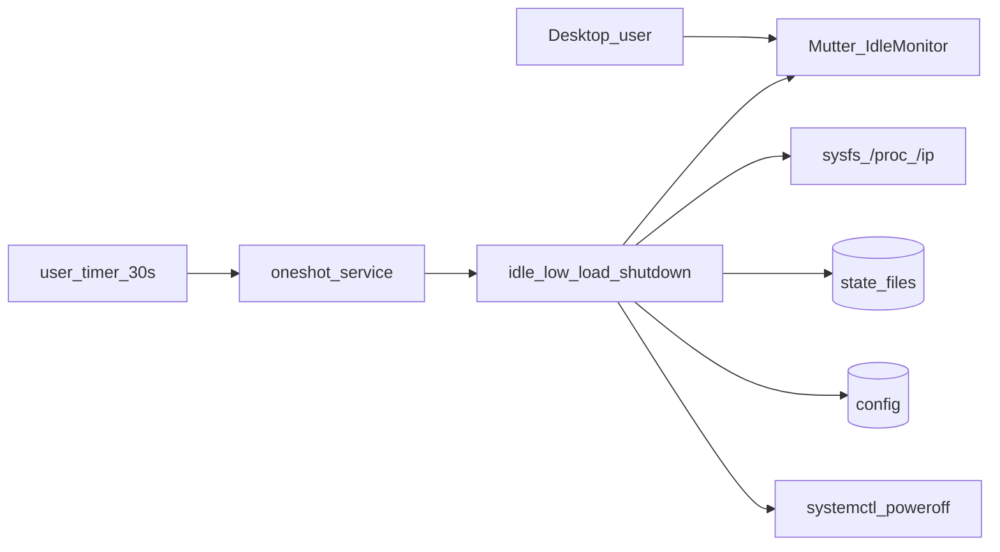
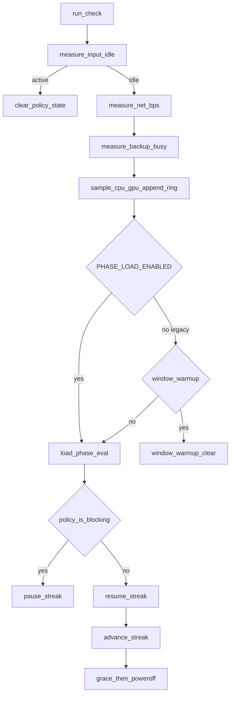

# Graceful shutdown — implementation

## Architecture (C4-ish)

### Container



### Component (checker)



**ADR:** [ADR-001](architecture/ADR-001-graceful-shutdown-policy.md)

## Components

| Layer | Path | Role |
|-------|------|------|
| Timer | `idle-low-load-shutdown.timer` | `OnUnitActiveSec=30` → oneshot service |
| Service | `idle-low-load-shutdown.service` | `DBUS_SESSION_BUS_ADDRESS`, `Conflicts=` self |
| Checker | `~/.local/bin/idle-low-load-shutdown` | Policy orchestration (`CHECKER_VERSION=gs-lib-2`) |
| Libs | `~/.local/bin/graceful-shutdown-lib/{idle,load,net,backup}.sh` | Metrics helpers (functions only) |
| Config | `~/.config/graceful-shutdown/config` | Thresholds, safety flags |
| State | `~/.local/state/graceful-shutdown/` | Streak, pause, hysteresis, net, log |

Structure-only lib peel. Source order after config: `idle.sh` → `load.sh` → `net.sh` → `backup.sh`.

## Supported config keys

| Key | Default | Role |
|-----|---------|------|
| `POWEROFF_ENABLED` | `0` | Real poweroff gate |
| `DRY_RUN` | `0` | Log-only action path |
| `INPUT_IDLE_SEC` | `60` | Mutter idle before streak |
| `LOW_LOAD_STREAK_SEC` | `840` | Effective streak length |
| `PHASE_LOAD_ENABLED` | `1` | Two-phase load (default) |
| `PHASE_A_SEC` | `600` | Critical-only portion of streak |
| `CPU_PHASE_A_MAX_PCT` | `65` | Phase A / grace critical CPU |
| `PHASE_B_WINDOW_SEC` | `180` | Rolling window for Phase B avg |
| `CPU_PHASE_B_MAX_PCT` / `GPU_PHASE_B_MAX_PCT` | `50` / `20` | Phase B rolling avg caps |
| `CPU_PHASE_B_SPIKE_MAX_PCT` | `80` | Any sample in window above this pauses |
| `CPU_MAX_PCT` / `GPU_MAX_PCT` | `10` / `15` | Legacy enter busy when phase off; GPU always instant |
| `CPU_IDLE_PCT` / `GPU_IDLE_PCT` | `7` / `10` | Leave busy floors when phase off |
| `HYSTERESIS_OK_POLLS` | `2` | Consecutive OK polls to leave busy |
| `GPU_DRM_CARD` | empty | Pin DRM card |
| `GPU_CHECK_VRAM` | `0` | Optional VRAM via rocm-smi |
| `LOAD_WINDOW_*` | enabled `0` | Legacy soft window when phase off |
| `NET_CHECK_ENABLED` | `1` | Bulk stay-awake |
| `NET_RX/TX_MIN_BPS` | `204800` | ~200 KiB/s floors |
| `NET_BUSY_POLLS` | `2` | Sustained bulk debounce |
| `NET_IFACE` | empty | Pin iface; empty = default-route |
| `BACKUP_CHECK_ENABLED` | `1` | Pause while Déjà Dup **work** |
| `BACKUP_TREAT_UI_PROCESS` | `0` | Legacy UI process busy |
| `GRACE_SEC` | `120` | Notify before poweroff |
| `EXT_CMD_TIMEOUT_SEC` | `5` | gdbus / rocm-smi timeout |
| `LOG_*` | see example | Heartbeat / journal / rotate |

## State files

| File | Set when | Cleared when |
|------|----------|--------------|
| `low-load-streak.epoch` | First quiet poll after input idle | User input, inhibit, grace cancel |
| `streak-pause-start.epoch` | Enter busy while streak exists | Resume (origin shifted) or policy clear |
| `load-hysteresis.state` | `idle` / `busy` | Policy clear |
| `hysteresis-ok.count` | Consecutive OK polls while busy | Leave busy / clear |
| `net-prev.tsv` | Each net sample | Resync on gap / iface change |
| `net-busy-strikes.count` | Consecutive bulk-rate polls | Below floor / clear |
| `grace-start.epoch` | First `eligible` | Busy, user input, before streak complete |
| `last-poll.epoch` | Completed check | — |
| `load-window.tsv` | Phase (or legacy window) samples | Policy clear; install clears on first PHASE key append |
| `check.lock` | `flock` | Process exit |

## Policy summary

```
# PHASE_LOAD_ENABLED=1 (default)
blocking_load = hysteretic(phase_A_or_B) OR sustained_net_bulk OR backup_active
phase_A (streak < PHASE_A_SEC): busy if CPU > CPU_PHASE_A_MAX or GPU/VRAM
phase_B: busy if rolling avg over PHASE_B_WINDOW_SEC exceeds Phase B caps,
         or spike, or critical/GPU; <5 samples → skip avg only
leave busy: same enter predicate false for HYSTERESIS_OK_POLLS (no 7% floor)

grace/poweroff abort: load_phase_critical_busy (instant critical/spike/GPU) OR net OR backup
                      sample "-" → abort (fail-closed); Phase B avg does NOT cancel grace
```

## Migration (v0.4 phase load)

`install-to-local.sh` appends missing keys from `example.config` without rewriting existing values. When any `PHASE_*` key is appended:

1. `PHASE_LOAD_ENABLED=1` (and related caps) become active on the next checker run.
2. `load-window.tsv` is cleared (drop rows marked against the old 10% rule).
3. Banner lists kill-switches: `inhibit`, `PHASE_LOAD_ENABLED=0`, `POWEROFF_ENABLED=0`, stop timer, unlock/input.
4. If `POWEROFF_ENABLED=1`, run `DRY_RUN=1 ~/.local/bin/idle-low-load-shutdown` a few times before relying on the timer.

To keep pre-v0.4 strict 10% CPU gating: set `PHASE_LOAD_ENABLED=0`.

## Logging

- **`poll:`** — idle, cpu/gpu/vram, load, streak, `phase=A|B`, optional `win_cpu_avg=` / `win_gpu_avg=`, `hyst=`, net, backup
- **`decision=streak_paused reason=`** — `load` \| `net` \| `backup` composed with `+`
- Timeouts on `gdbus` / `rocm-smi`; sysfs GPU preferred; early `mark_poll_now`

## Metrics

### Input idle

- **Unlocked:** Mutter `GetIdletime` first, then `loginctl` IdleSinceHint
- **Locked (`LockedHint=yes`):** prefer `loginctl` first, then Mutter
- External cmds via `timeout -k` (`EXT_CMD_TIMEOUT_SEC`)

### CPU / GPU (phase mode)

- CPU: `/proc/stat` over `CPU_SAMPLE_SEC`
- GPU: sysfs `gpu_busy_percent` (optional `GPU_DRM_CARD`); `rocm-smi` fallback
- Main sets `EFFECTIVE_STREAK_SEC` before load hysteresis / grace helpers
- Ring: always append while phase on; epoch-trim to `PHASE_B_WINDOW_SEC`

### Soft load window (`LOAD_WINDOW_ENABLED=1`, phase off only)

Ring of `LOAD_WINDOW_POLLS` samples. Prefer `LOAD_WINDOW_MAX_HIGH`. Default metric **`avg`**. `window_warmup` clears streak only in legacy mode.

### Network bulk / Backup / Streak pause / Poweroff

Unchanged from prior releases (default-route iface; Déjà Dup work; pause origin shift; `systemctl poweroff` after grace with inhibit respect).

## Concurrency

`flock -n` on `check.lock`; service `TimeoutStartSec=60`; timer `AccuracySec=1s`.

## set -e pitfalls (lesson 2026-07-14)

Under `set -e`, **command substitutions** abort the script when the substituted command returns non-zero. Prefer `if [[ -f ]]; then cat; fi` for optional state files.

## Verification

```bash
./scripts/test/test-policy-math.sh
GS_TOPIC_ROOT="$PWD" ./scripts/verify-graceful-shutdown.sh
DRY_RUN=1 ~/.local/bin/idle-low-load-shutdown
./scripts/ci-check.sh
```

## Related

- [README.md](../README.md)
- [ADR-001](architecture/ADR-001-graceful-shutdown-policy.md)
